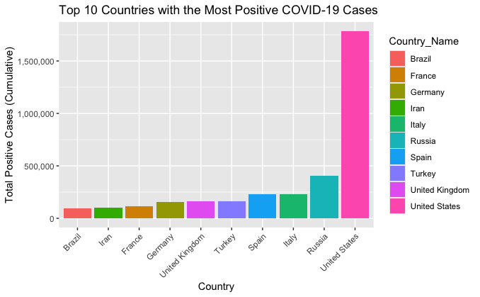
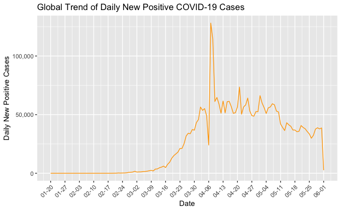
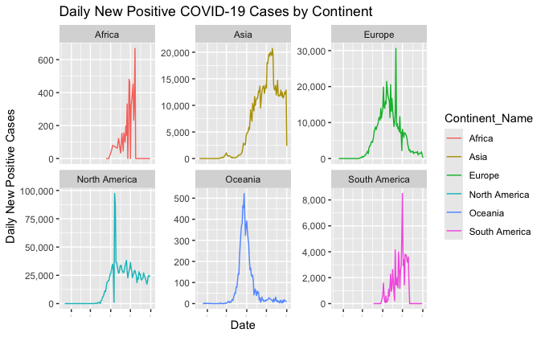
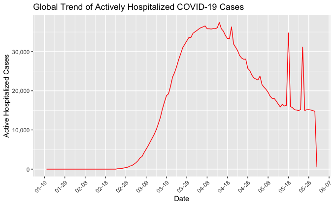
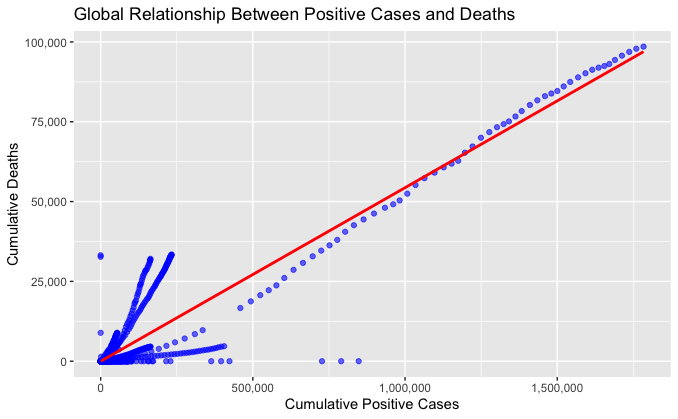
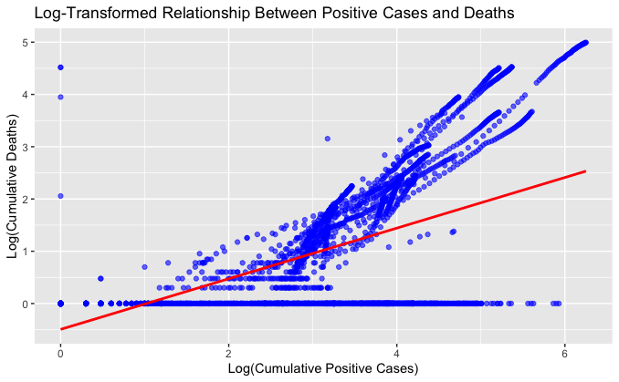
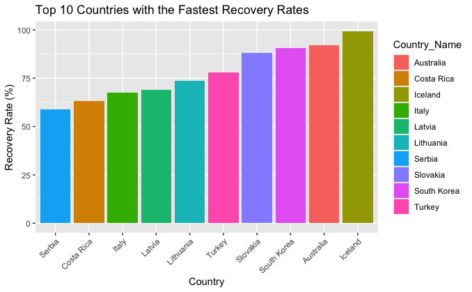
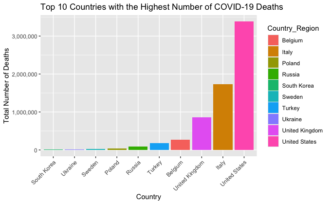
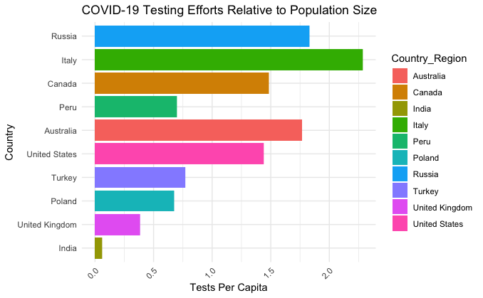

# Investigating COVID-19 Virus Trends

This project analyzes a dataset downloaded from Kaggle which includes information collected between January 20th - June 1st 2020.

This report explores key trends and insights f from global and regional COVID-19 data, examining how different countries and regions have been affected by the pandemic. By analyzing various metrics—such as the number of cases, tests, hospitalizations, recoveries, and deaths—this report aims to shed light on the effectiveness of different response strategies and the relative impact of COVID-19 across populations.

### Understanding the Data

In data analysis, it's important to understand the dataset you are working with before attempting to analyze and draw conclusions from it. For example, how big is the dataset? What kind of data does it contain? Are there any issues with the dataset, e.g. missing values, unclear column headers.

Our dataset contains the daily and cumulative number of COVID-19 tests conducted, number of positive, hospitalized, recovered & death cases reported by country. More specifically, the details of the columns are:

- Date: date
- Continent_Name: continent names
- Two_Letter_Country_Code: country codes
- Country_Region: country names
- Province_State: States / province names; value is `All States` when state/provincial level data is not available
- positive: Cumulative number of positive cases reported
- active: Number of actively cases on that day
- hospitalized: Cumulative number of hospitalized cases reported
- hospitalizedCurr: Number of actively hospitalized cases on that day
- recovered: Cumulative number of recovered cases reported
- death: Cumulative number of deaths reported
- total_tested: Cumulative number of tests conducted
- daily_tested: Number of tests conducted on the day; if daily data is unavailable, daily tested is averaged across number of days in between.
- daily_positive: Number of positive cases reported on the day; if daily data is unavailable, daily positive is averaged across number of days in between

```r
covid_data = read.csv("/Users/hhorn/Projects/Personal/COVID_R_Project/covid19.csv")

dim(covid_data)
# There is 10,903 rows in the dataset
# There is 14 columns in the dataset
```

### Preparing Data for Analysis

Our dataset contains inconsistencies in the Province_State column, where some rows refer to U.S. states, while others contain country names. To address this, we'll filter the data to focus on country-level information, specifically where Province_State is labeled "All States," and remove the Province_State column.

```r
# filter the data to focus on country-level data (where Province_State is 'All States')
covid_all_states = covid_data[covid_data$Province_State == "All States", ]

# remove the 'Province_State' column -- not relevant
covid_all_states$Province_State = NULL
```

Additionally, we need to handle cumulative and daily data separately, as mixing these could lead to misleading conclusions. Cumulative data tracks totals over time (e.g., positive, hospitalized), while daily data represents new cases or tests on a specific day (e.g., daily_positive, daily_tested). By separating these two types of data, we ensure our analysis remains accurate and avoids potential bias. This step is crucial to drawing valid insights from the data without conflating different metrics.

```r
# filter columns containing cumulative data 
covid_all_states_total = covid_all_states[, c("Date", "Continent_Name" , "Two_Letter_Country_Code", "positive", "hospitalized", "recovered", "death", "total_tested")]

# filter columns containing daily data
covid_all_states_daily = covid_all_states[, c("Date","Continent_Name", "Country_Region", "active", "hospitalizedCurr", "daily_tested", "daily_positive")]
```

### Analyzing the Data
Through a combination of time-series analysis, correlation studies, and regional comparisons, this report provides a comprehensive view of how the pandemic has unfolded across the world.

```r
# main libraries used for analysis imported here
library(ggplot2)
library(dplyr)
library(countrycode)  # to convert country codes to full name
library(scales)
library(knitr)
```

#### Which Countries Have Reported the Most Positive COVID-19 Cases Overall?


```r
# use the aggregate function to group the data by country and calculate the total number of positive cases for each country
country_positive_cases =  aggregate(positive ~ Two_Letter_Country_Code, data = covid_all_states_total, FUN = max)

# convert country code to country names
country_positive_cases$Country_Name = countrycode(country_positive_cases$Two_Letter_Country_Code, origin = "iso2c", destination = "country.name")

# to find most positive cases -> sort in descending order
country_positive_cases_sorted = country_positive_cases[order(-country_positive_cases$positive), ]

# identify the top 10 countries from list
top_10_positive_cases = head(country_positive_cases_sorted, 10)

# check that it is a numeric value
top_10_positive_cases$positive = as.numeric(top_10_positive_cases$positive)

# visualization of top 10 countries
ggplot(top_10_positive_cases, aes(x = reorder(Country_Name, positive), y = positive, fill = Country_Name)) + 
  geom_bar(stat = "identity") + 
  labs(title = "Top 10 Countries with the Most Positive COVID-19 Cases",
       x = "Country",
       y = "Total Positive Cases (Cumulative)") + 
  theme(axis.text.x = element_text(angle = 45, hjust = 1)) +
  scale_y_continuous(labels = scales::comma)
```




#### What is the Trend of Daily New Positive Cases Globally

```r
# filter the data
covid_daily_positive = covid_all_states_daily[, c("Date", "Continent_Name", "Country_Region", "daily_positive")]

# aggregate daily new cases globally
global_daily_positive = aggregate(daily_positive~Date, data = covid_daily_positive, FUN = sum)

# check that the date column is treated as a date type
global_daily_positive$Date = as.Date(global_daily_positive$Date)

# visualization
ggplot(global_daily_positive, aes(x = Date, y = daily_positive)) + 
  geom_line(color = "orange", linewidth = 0.5) + 
  labs(title = "Global Trend of Daily New Positive COVID-19 Cases", 
       x = "Date", 
       y = "Daily New Positive Cases") + 
  scale_y_continuous(labels = scales::comma) +  
  scale_x_date(date_breaks = "1 week", date_labels = "%m-%d") +  
  theme(axis.text.x = element_text(angle = 45, hjust = 1))  

```




#### What is the Trend of Daily New Positive Cases by Continent?

```r
# aggregate daily new cases by continent
continent_daily_positive = aggregate(daily_positive~Date + Continent_Name, data = covid_daily_positive, FUN = sum)

# check that the date column is treated as a date type
continent_daily_positive$Date = as.Date(continent_daily_positive$Date)

# visualization -- side by side comparison
ggplot(continent_daily_positive, aes(x = Date, y = daily_positive, color = Continent_Name)) + 
  geom_line(size = 0.5) + 
  labs(title = "Daily New Positive COVID-19 Cases by Continent", 
       x = "Date", 
       y = "Daily New Positive Cases") + 
  scale_y_continuous(labels = scales::comma) +
  scale_x_date(date_breaks = "1 month", date_labels = "%m-%d") +
  theme(axis.text.x = element_text(angle = 60, hjust = 1, vjust = 1, size = 1)) + 
  facet_wrap(~ Continent_Name, scales = "free_y")
```



#### What Are The Trends in COVID-19 Hospitalizations Over Time Globally?

```r
# filter data 
covid_all_states_daily = covid_all_states[, c("Date", "hospitalizedCurr")]

# check that the date column is treated as a date type
covid_all_states_daily$Date = as.Date(covid_all_states_daily$Date)

# aggregate daily actively hospitalized cases globally (sum by Date)
global_daily_hospitalized_curr = aggregate(hospitalizedCurr ~ Date, data = covid_all_states_daily, FUN = sum)

# visualization of global trend of actively hospitalized cases
ggplot(global_daily_hospitalized_curr, aes(x = Date, y = hospitalizedCurr)) + 
  geom_line(color = "red", size = 0.5) +
  labs(title = "Global Trend of Actively Hospitalized COVID-19 Cases", 
       x = "Date", 
       y = "Active Hospitalized Cases") + 
  scale_y_continuous(labels = scales::comma) +
  scale_x_date(date_breaks = "10 days", date_labels = "%m-%d") +
  theme(axis.text.x = element_text(angle = 45, hjust = 1))

```



#### What is the Relationship Between the Number of Deaths and the Number of Positive Cases?

```r
# check that both attributes are treated as numeric and remove any NAs
covid_all_states_total$positive = as.numeric(covid_all_states_total$positive)
covid_all_states_total$death = as.numeric(covid_all_states_total$death)

# find the correlation
correlation = cor(covid_all_states_total$positive, covid_all_states_total$death, use = "complete.obs")
print(paste("Correlation between Positive Cases and Deaths (Globally):", round(correlation, 3)))

# Plot 1: Linear scatter plot with regression line
ggplot(covid_all_states_total, aes(x = positive, y = death)) + 
  geom_point(alpha = 0.6, color = "blue") +
  geom_smooth(method = "lm", color = "red", se = FALSE) +
  labs(title = "Global Relationship Between Positive Cases and Deaths", 
       x = "Cumulative Positive Cases", 
       y = "Cumulative Deaths") +
  scale_x_continuous(labels = scales::comma) +
  scale_y_continuous(labels = scales::comma)
```


The correlation of this scatter plot above is **0.922**. However, since most of the dots fall in the lower left corner, I decided to log transform the data to see if I could visualize a better pattern.

```r
# log-transform the data (log base 10) to reduce skewness
covid_all_states_total$log_positive = log10(covid_all_states_total$positive + 1)
covid_all_states_total$log_death = log10(covid_all_states_total$death + 1)

# find the new correlation
log_correlation = cor(covid_all_states_total$log_positive, covid_all_states_total$log_death, use = "complete.obs")
print(paste("Correlation between Log(Positive Cases) and Log(Deaths):", round(log_correlation, 3)))

# Plot 2: Log-transformed scatter plot with regression line
ggplot(covid_all_states_total, aes(x = log_positive, y = log_death)) + 
  geom_point(alpha = 0.6, color = "blue") +
  geom_smooth(method = "lm", color = "red", se = FALSE) +
  labs(title = "Log-Transformed Relationship Between Positive Cases and Deaths", 
       x = "Log(Cumulative Positive Cases)", 
       y = "Log(Cumulative Deaths)") +
  scale_x_continuous(labels = scales::comma) +
  scale_y_continuous(labels = scales::comma) 
```


The correlation of this scatter plot above is **0.589**. While the log transformation had a weaker relationship than the previous linear one, it was helpful to see the data points more spread out. 


#### Which Countries Have Had the Highest and Lowest Case Fatality Rates?

```r
# filter for relevant columns
covid_all_states_filtered = covid_all_states_total[, c("Two_Letter_Country_Code", "positive", "death")]

# check that columns are recognized as numeric
covid_all_states_filtered$positive = as.numeric(covid_all_states_filtered$positive)
covid_all_states_filtered$death = as.numeric(covid_all_states_filtered$death)

# remove rows where positive cases or deaths are NA, or where positive cases are 0
covid_all_states_filtered = covid_all_states_filtered %>%
  filter(!is.na(positive), !is.na(death), positive > 0)

# aggregate results by country to get the total positive cases and deaths
country_totals = covid_all_states_filtered %>%
  group_by(Two_Letter_Country_Code) %>%
  summarise(total_positive = sum(positive), total_death = sum(death)) %>%
  ungroup()

# calculate the fatality rate for each country
country_totals = country_totals %>%
  mutate(CFR = total_death / total_positive * 100)

# convert from country code to name
country_totals$Country_Name = countrycode(country_totals$Two_Letter_Country_Code, origin = "iso2c", destination = "country.name")

# sort countries
cfr_sorted = country_totals %>%
  arrange(desc(CFR))

# identify top 5 countries with highest fatality
top_5_cfr = head(cfr_sorted, 5)

# find bottom 5 countries (exclude zero to avoid misleading data)
bottom_5_cfr = tail(cfr_sorted[cfr_sorted$CFR > 0, ], 5)

# display the results
kable(top_5_cfr[, c("Country_Name", "CFR")], caption = "Top 5 Countries with Highest Fatality Percentage")

kable(bottom_5_cfr[, c("Country_Name", "CFR")], caption = "Bottom 5 Countries with Lowest Fatality Percentage (Excluding Zero)")
```

**Top 5 Countries with Highest Fatality Percentage**
| Country Name      | Fatality         |
|-------------------|-------------|
| United Kingdom    | 16.02%      |
| Belgium           | 14.12%      |
| Sweden            | 12.57%      |
| Italy             | 12.38%      |
| Greece            | 5.10%       |


**Bottom 5 Countries with Lowest Fatality Percentage (Excluding Zero)**
| Country Name      | Fatality         |
|-------------------|-------------|
| Australia         | 1.16%       |
| Russia            | 0.98%       |
| Costa Rica        | 0.84%       |
| Canada            | 0.21%       |
| Singapore         | 0.08%       |


#### What Are The Countries With The Fastest Recovery Rates?
```r
# filter for relevant columns 
covid_recovery_data = covid_all_states_total[, c("Two_Letter_Country_Code", "positive", "recovered", "Date")]

# aggregate data by country
covid_recovery_data_latest = covid_recovery_data %>%
  group_by(Two_Letter_Country_Code) %>%
  filter(Date == max(Date)) %>% 
  ungroup()                     

# remove rows with missing or zero recovery or positive cases to avoid errors
covid_recovery_data_latest = covid_recovery_data_latest %>%
  filter(positive > 0, recovered > 0)

# calculate each country's recovery rate
covid_recovery_data_latest$recovery_rate = (covid_recovery_data_latest$recovered / covid_recovery_data_latest$positive) * 100

# sort in descending order to find highest
covid_recovery_data_sorted = covid_recovery_data_latest %>%
  arrange(desc(recovery_rate))

# convert to country names
covid_recovery_data_sorted$Country_Name = countrycode(covid_recovery_data_sorted$Two_Letter_Country_Code, origin = "iso2c", destination = "country.name")

# identify top 10 countries 
top_countries_recovery = head(covid_recovery_data_sorted, 10)
top_countries_recovery$recovery_rate = round(top_countries_recovery$recovery_rate, 2)

# display results
print(top_countries_recovery[, c("Country_Name", "recovery_rate")])
```

| Country Name    | Recovery Rate (%) |
|-----------------|-------------------|
| Iceland         | 99.34             |
| Australia       | 91.88             |
| South Korea     | 90.60             |
| Slovakia        | 88.03             |
| Turkey          | 78.06             |
| Lithuania       | 73.79             |
| Latvia          | 69.13             |
| Italy           | 67.60             |
| Costa Rica      | 63.35             |
| Serbia          | 58.85             |

```r
# visualization
ggplot(top_countries_recovery, aes(x = reorder(Country_Name, recovery_rate), y = recovery_rate, fill = Country_Name)) + 
  geom_bar(stat = "identity") + 
  labs(title = "Top 10 Countries with the Fastest Recovery Rates",
       x = "Country",
       y = "Recovery Rate (%)") + 
  theme(axis.text.x = element_text(angle = 45, hjust = 1)) +
  scale_y_continuous(labels = scales::comma)
```



#### Which Countries Have Had the Highest Number of Deaths Due to COVID-19

```r
# filter for relevant columns 
covid_death_data = covid_all_states_total[, c("Two_Letter_Country_Code", "death")]

# convert country code to name
covid_death_data$Country_Region = countrycode(covid_death_data$Two_Letter_Country_Code, "iso2c", "country.name")

# aggregate data by country
country_deaths = covid_death_data %>%
  group_by(Country_Region) %>%
  summarise(total_deaths = sum(death, na.rm = TRUE)) %>%
  arrange(desc(total_deaths))

# identify top 10 countries 
top_10_countries_deaths = head(country_deaths, 10)

# visualization
ggplot(top_10_countries_deaths, aes(x = reorder(Country_Region, total_deaths), y = total_deaths, fill = Country_Region)) + 
  geom_bar(stat = "identity") +
  labs(title = "Top 10 Countries with the Highest Number of COVID-19 Deaths", 
       x = "Country", 
       y = "Total Number of Deaths") + 
  theme(axis.text.x = element_text(angle = 45, hjust = 1)) +
  scale_y_continuous(labels = scales::comma)
```




#### Which Countries Have Made the Best Effort in Terms of the Number of COVID-19 Tests Conducted Relative to their Population?

Using these populations:

- United States: 331,002,651
- Russia: 145,934,462
- Italy: 60,461,826
- India: 1,380,004,385
- Turkey: 84,339,067
- Canada: 37,742,154
- United Kingdom: 67,886,011
- Australia: 25,499,884
- Peru: 32,971,854
- Poland: 37,846,611

```r
# input population data for each country
population_data = data.frame(
  Country_Region = c("United States", "Russia", "Italy", "India", "Turkey", "Canada", 
                     "United Kingdom", "Australia", "Peru", "Poland"),
  population = c(331002651, 145934462, 60461826, 1380004385, 84339067, 37742154, 
                 67886011, 25499884, 32971854, 37846611)
)

# add country codes column 
population_data$Two_Letter_Country_Code = countrycode(population_data$Country_Region, "country.name", "iso2c")

covid_test_data = covid_all_states_total[, c("Two_Letter_Country_Code", "total_tested")]

# merge the population data with rest of data
covid_test_data = merge(covid_test_data, population_data, by = "Two_Letter_Country_Code")

# calculate testing rate
covid_test_data$tests_per_capita = covid_test_data$total_tested / covid_test_data$population

# sort the results
covid_test_data_sorted = covid_test_data %>%
  arrange(desc(tests_per_capita))

# visualization
ggplot(covid_test_data_sorted, aes(x = reorder(Country_Region, tests_per_capita), y = tests_per_capita, fill = Country_Region)) + 
  geom_bar(stat = "identity") +  
  labs(title = "COVID-19 Testing Efforts Relative to Population Size",
       x = "Country",
       y = "Tests Per Capita") + 
  theme(axis.text.x = element_text(angle = 45, hjust = 1)) + 
  scale_y_continuous(labels = scales::comma) + 
  coord_flip() 
```

